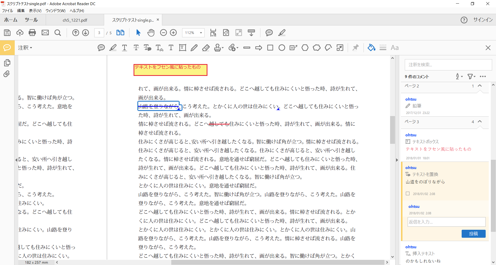

# INDD_ImportXFDF（XFDFファイルをInDesignに読み込む）
## 使い方
1. InDesignでPDFを書き出す（単ページで）。
2. Acrobatで注釈を入れる。
3. 注釈サイドバーで［…］をクリックして［すべてをデータファイルに書き出し］を選択。
4. ファイル形式をXFDFにして保存。
5. InDesignでスクリプトを実行し、XFDFファイルを選択して開く。

## 備考
- PDFは見開きではなく単ページで書き出しておく。
- 注釈レイヤーとannotationというスタイルが自動的に追加される。
- 現状は注釈の外枠とテキストだけを表示している。XMLの中には対象範囲を細かく表す座標データがあるが現状未使用。
- 見やすくなるよう加工できれば役に立つかも……？
